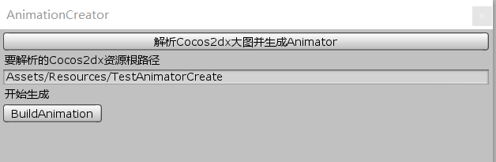

## 简介
Cocos2dx plist帧动画资源生成Unity Animator插件

## 目的
为了解决Cocos2dx 帧动画资源无法在Unity中直接使用, 需要手动制作的问题。

## 如何使用
 - 将cocos2dx帧动画资源 plist文件, png文件, xml文件分成三个文件夹。如图：

 - 右键点击TestAnimatorCreate -> BuildAnimation -> ParseCocosToAnimation
 - 点击BuildAnimation，如图：
 

 - 创建完成后在资源同目录生成Animation、Controller、prefab

## 目前支持
Cocos2dx plist帧动画 format=2, 3的解析